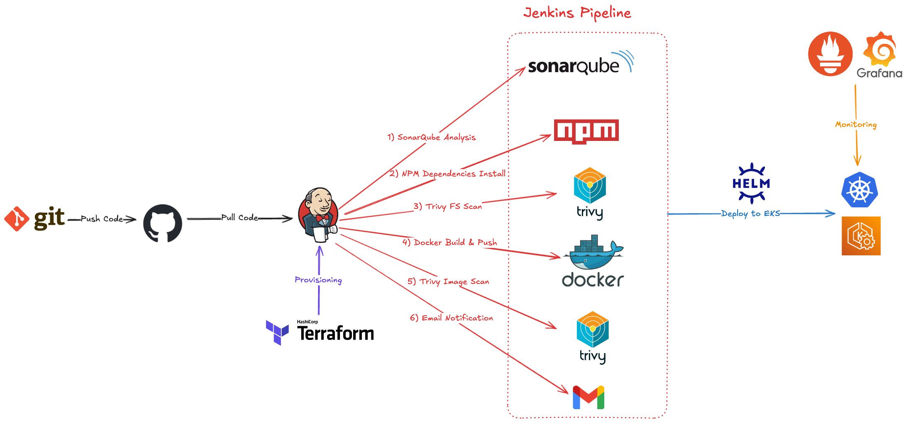
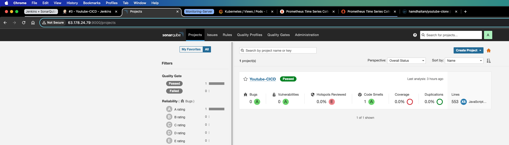
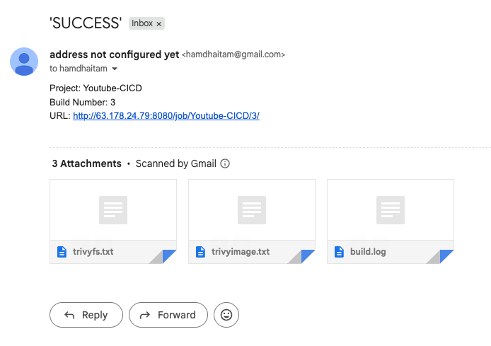
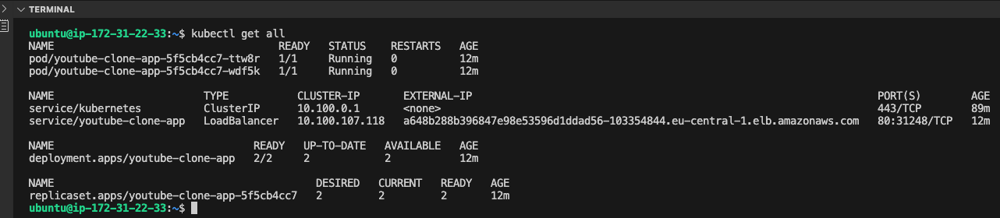
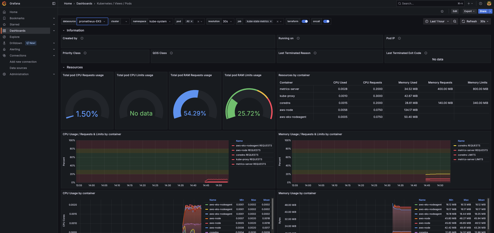

# DevSecOps CI/CD Pipeline with IaC and Monitoring


This project demonstrates a full DevSecOps pipeline using Jenkins, Docker, SonarQube, Trivy, Terraform, AWS EKS, Prometheus, and Grafana.



## 🛠 Tools Used
- Jenkins
- SonarQube
- Trivy
- Docker & Docker Hub
- Terraform
- Kubernetes (EKS)
- AWS EC2 & IAM
- Prometheus & Grafana

## 🔄 Pipeline Flow
1. Jenkins pulls the [application code](https://github.com/hamdhaitam/a-youtube-clone-app) from GitHub.
2. SonarQube performs static code analysis.
3. Trivy scans Docker images for vulnerabilities.
4. Docker image is built and pushed to Docker Hub.
5. Terraform provisions EKS infrastructure (IaC).
6. Application is deployed to AWS EKS using `kubectl`.
7. Prometheus and Grafana are configured for monitoring and visualization.

## 📦 Deployment Output
Application is deployed to a publicly accessible LoadBalancer on AWS EKS: `http://<lb-endpoint>:80`

## 📁 Project Structure
```
devsecops-cicd-iac-monitoring/
├── jenkins/
│   └── Jenkinsfile
├── prometheus/
│   └── prometheus.yml
├── screenshots/
│   └── ...
├── terraform/
│   ├── Jenkins-SonarQube-VM/
│   │   ├── install.sh
│   │   ├── main.tf
│   │   └── provider.tf
│   └── Monitoring-Server/
│       ├── install.sh
│       ├── main.tf
│       └── provider.tf
├── README.md
├── SETUP.md
└── LICENSE
```

## 📸 Screenshots








## 📄 Setup Instructions
For full setup instructions, see [SETUP.md](./SETUP.md)